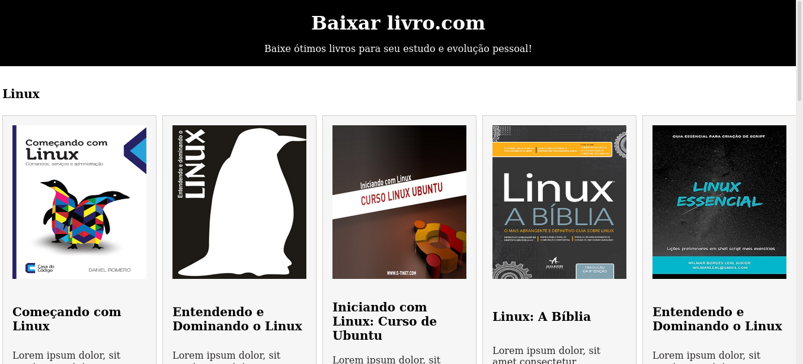

  <h1>Baixe livros gratuitamente</h1>
    
    
    
    
     
     
     

Este projeto consiste em uma página web, desenvolvida com react e CSS3, onde o usuário pode baixar livros focados sobre os temas como Linux, java e Python, focadosno seu desenvolvimento pessoal. Basta fazer donwload do livro desejado e começar a leitura.

  
Desenvolvido por <a target="_blank" rel="external" href="https://github.com/MegMinnie/"><strong>Mirele Oliveira da Silva</strong></a>

 

 

  
  ## Como Acessar a Aplicação

Acesse a aplicação por meio do link: <a href="https://megminnie.github.io/Baixar-livros/
"_blank">clique aqui</a>

## Screenshots

